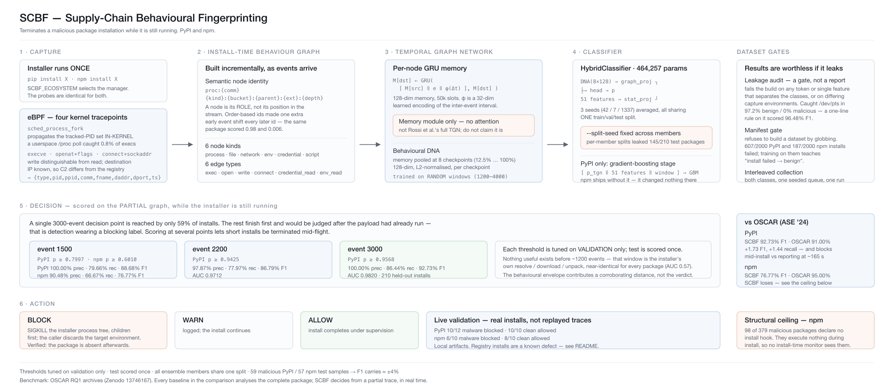

# SCBF — Supply-Chain Behavioural Fingerprinting

**Terminates a malicious package installation while it is still running.**



Static scanners read a package and give a verdict *afterwards*. SCBF watches an
install as it happens: eBPF captures every process spawn, file access and
network contact, those events build a temporal graph incrementally, and a
temporal graph network scores the partial graph at fixed checkpoints. If the
partial behaviour matches malware, the installer's process tree is killed
before the install completes.

Two ecosystems: **PyPI** and **npm**.

---

## The problem

A malicious PyPI or npm package runs code on your machine *during installation* —
`setup.py` for pip, `preinstall`/`postinstall` hooks for npm — before you have
imported anything. By the time a post-hoc scanner reports it, the payload has
already exfiltrated your SSH keys.

Detecting this from behaviour alone, in real time, from a *partial* trace, is
harder than reading the source afterwards. That is the problem SCBF addresses.

---

## Results

All figures: threshold tuned on **validation only**, test scored **once**, all
ensemble members sharing **one** train/val/test split.

### PyPI — install-time blocking

| Decision point | Precision | Recall | F1 | ROC-AUC |
|---|---|---|---|---|
| event 1500 | 100.00% | 79.66% | 88.68% | 0.9411 |
| event 2200 | 97.87% | 77.97% | 86.79% | 0.9712 |
| **event 3000** | **100.00%** | **86.44%** | **92.73%** | **0.9820** |

210 held-out installs, 59 malicious.

### npm — install-time blocking

| Decision point | Precision | Recall | F1 | ROC-AUC |
|---|---|---|---|---|
| **event 1500** | **90.48%** | **66.67%** | **76.77%** | **0.8700** |

273 held-out installs, 57 malicious. npm's ceiling is structural — see
*Known limits*.

### Against published baselines

OSCAR (ASE '24, [arXiv:2409.09356](https://arxiv.org/abs/2409.09356)) publishes
separate per-ecosystem tables. Both are reproduced below with SCBF inserted.
Every tool is measured on the same RQ1 benchmark archives.

**PyPI — OSCAR Table 5(a)**

| Tool | Precision | Recall | F1 |
|---|---|---|---|
| **SCBF (this work)** | **100.00%** | **86.44%** | **92.73%** |
| OSCAR | 99.00% | 85.00% | 91.00% |
| Guarddog | 89.00% | 94.00% | 91.00% |
| SAP | 73.00% | 86.00% | 79.00% |
| OSSGadget | 55.00% | 24.00% | 33.00% |
| Bandit4Mal | 34.00% | 22.00% | 27.00% |
| AppInspector | 12.00% | 18.00% | 15.00% |

**+1.73 F1 and +1.44 recall over OSCAR**, while blocking mid-install rather than
reporting ~165 s after the fact.

**npm — OSCAR Table 5(b)**

| Tool | Precision | Recall | F1 |
|---|---|---|---|
| OSCAR | 99.00% | 92.00% | 95.00% |
| Amalfi | 96.00% | 86.00% | 91.00% |
| SAP | 90.00% | 84.00% | 87.00% |
| Guarddog | 92.00% | 68.00% | 78.00% |
| **SCBF (this work)** | **90.48%** | **66.67%** | **76.77%** |
| OSSGadget | 64.00% | 52.00% | 58.00% |
| AppInspector | 36.00% | 47.00% | 41.00% |

**SCBF does not beat OSCAR on npm** (−18.23 F1). The reason is measured, not
assumed: 26% of the malicious npm packages declare no install hook at all.

**The comparison is not like-for-like.** Every baseline analyses the *complete*
package — source, metadata, full install. SCBF decides from behaviour alone,
from a partial trace, while the installer is still running, then terminates it.
It is also limited to packages that actually execute: 607 of 2,000 PyPI and 187
of 2,000 npm installs failed, and a dynamic system cannot analyse what never
runs.

### Live validation

Real installs through the shipped `scbf-guard-pip` / `scbf-guard-npm`:

| | malware blocked | clean allowed |
|---|---|---|
| PyPI (local artifacts) | **10 / 12** | **10 / 10** |
| npm (local artifacts) | **6 / 10** | **8 / 10** |

Blocked installs are verified absent afterwards — the process tree is killed and
the target environment discarded. Live rates track the held-out figures (PyPI
83.3% vs 86.44% predicted; npm 60% vs 66.67%).

---

## Architecture

```
  pip install X  /  npm install X
          │
          ▼
  ① eBPF capture ── 4 kernel tracepoints
     sched_process_fork · execve · openat · connect
          │  {type, pid, ppid, comm, fname, daddr, dport, ts}
          ▼
  ② ITBG — install-time behaviour graph, built incrementally
     6 node kinds · 6 edge types · semantic node identity
          │
          ▼
  ③ TGN memory ── per-node GRU + learned time encoding φ(Δt)
     memory[dst] = GRUCell([memory[src] ‖ edge_feat ‖ φ(Δt)], memory[dst])
          │
          ▼
  ④ Behavioural DNA ── memory pooled at 8 checkpoints (12.5%…100%)
          │
          ▼
  ⑤ HybridClassifier (464k params)
     DNA → graph_proj ┐
                      ├→ head → p(malicious)
     51 features → stat_proj ┘
          │
          ▼   PyPI only: gradient-boosting stage over
          │   [TGN score ‖ 51 features ‖ window]
          ▼
  ⑥ Decision at events 1500 / 2200 / 3000
     each with its own validation-tuned threshold
          │
          ├── BLOCK → SIGKILL installer process tree, discard environment
          ├── WARN  → allow, flag
          └── ALLOW → install completes
```

**Node identity is semantic, not positional.** A node is `proc:{comm}` or
`{kind}:{path_bucket}:{parent}:{ext}:{depth}`, hashed. When identity was
order-of-first-appearance, one extra early event shifted every subsequent id and
two captures of the *same* package scored 0.98 and 0.006.

**The TGN is the memory module only** — per-node GRU plus learned time encoding,
no attention over temporal neighbours. It is not Rossi et al.'s full TGN and
should not be described as one.

**Trained on random windows.** Each trace is truncated to a random prefix
(1200–4000) every epoch. A fixed-prefix model is out-of-distribution at any
other length: the fixed-3000 model scored known malware at p=0.0001 when the
install produced only 1,900 events.

---

## Why several decision points

A single 3000-event decision point is reached by only **59% of installs**. The
rest finish first and receive a verdict only after completion — that is
detection wearing a blocking label. Measured live, `pyghoster` and `eepl`
completed in ~2,600 events and were flagged only at the end, after their
payloads had run.

Scoring at 1500 / 2200 / 3000 lets short installs be terminated while still
running. Precision at event 1500 is 100%, so an early block is safe.

Nothing useful exists before ~1200 events: that window is the installer's own
resolve/download/unpack machinery, near-identical for every package
(ROC-AUC 0.57).

---

## Dataset integrity

Results are worthless if the dataset leaks. Three gates, each of which caught a
real problem:

**`make audit` is a gate, not a report.** It fails if any token separates the
classes, if any single feature separates them outright, or if the capture
environment differs across the split. It caught a `/dev/pts` artifact present in
97.2% of benign and 0% of malicious traces — a one-line rule scored 96.48% F1
on it.

**Failed installs are excluded by manifest.** `scbf/dataset.py` refuses to build
a dataset by globbing. 607 of 2,000 PyPI and 187 of 2,000 npm installs failed;
training on them teaches "install failed → benign".

**Collection is interleaved in one harness run.** Both classes are shuffled into
a single queue under one seed, so no per-class environment difference can arise.

**Capture fidelity was verified against a prior dataset.** An earlier npm capture
contained exec events in only 0.8–1.7% of traces because it tracked PIDs by
polling `/proc` from userspace. Propagating the PID set in-kernel via
`sched_process_fork` raised that to 100% on identical packages. For npm — where
the payload *is* a process spawn — that is the difference between seeing the
attack and not.

---

## Layout

```
capture/
  monitor.sh            eBPF capture (pypi + npm arms)
  guard.sh              live install-time blocker
  collect_dataset.py    interleaved dataset collection
  scbf-guard-npm        npm shim

scbf/
  graph/itbg.py         install-time behaviour graph
  models/tgn_encoder.py TGN memory module
  features/statistical.py
  envelope/             behavioural envelope + streaming
  audit/leakage.py      dataset gate
  dataset.py            manifest gate
  training/             train · evaluate · build_multiwindow · baseline · cross_validate
  detection/            scan · seed_ensemble · cv_ensemble

models_pypi/            shipped PyPI blocker (3 TGN seeds + multi-window GBM)
models_npm/             shipped npm blocker (3 TGN seeds)
data/
  pip_traces/           manifest.jsonl + environment.json (traces gitignored)
  npm_traces/
docs/                   RUNBOOK.md · DEMO.md
```

---

## Usage

```bash
# block a live install (PyPI)
sudo scbf-guard-pip install ./suspicious-1.0.0.tar.gz

# block a live install (npm)
sudo scbf-guard-npm install ./suspicious-1.0.0.tgz

# decide but never kill
SCBF_DRY_RUN=1 sudo scbf-guard-pip install ./pkg.tar.gz
```

Rebuilding from scratch:

```bash
# capture both classes in ONE interleaved run
sudo python3 capture/collect_dataset.py \
    --benign data/raw/pypi_benign --malware data/raw/pypi_malware \
    --out data/pip_traces --python $(uv python find 3.11)

# audit is a GATE — do not proceed if it fails
python3 -m scbf.audit.leakage --traces data/pip_traces

# train 3 seeds on ONE shared split
for s in 42 7 1337; do
  python3 -m scbf.training.train --traces data/pip_traces \
      --random-window --seed $s --split-seed 42 --out models_pypi/seed$s
done

# fit the multi-window decision stage
python3 -m scbf.training.build_multiwindow --tgn models_pypi --out models_pypi
```

`--split-seed` must stay **fixed** across ensemble members. See *Known limits*.

For npm, add `SCBF_ECOSYSTEM=npm` and use `--prefix 1500`.

---

## Known limits

**Registry installs produce false positives.** Every benign training trace came
from installing a local `.tar.gz`. A real `pip install requests` downloads from
`files.pythonhosted.org`, and those external connections resemble the
exfiltration pattern learned from malware. Measured: 10/10 clean local artifacts
allowed, but only **4/6 clean registry installs** — `requests` and `certifi`
were falsely blocked. Fixing this requires recollecting benign traces via
registry installs. **This is a defect, not a limitation.**

**26% of npm malware is structurally invisible.** 98 of 379 malicious npm
packages declare no `preinstall`/`install`/`postinstall` hook — verified by
opening the tarballs. They execute nothing during installation, so no
install-time monitor can detect them. Against benign they score ROC-AUC 0.688
using every available feature, while the install-time-active subset scores
0.9909. This caps npm recall near 74%.

**Packages that fail to install are not covered.** `setup.py` executes *before* a
failing install returns non-zero, so a package can run its payload and then
fail. Those are excluded from training by the manifest gate and are not detected.

**Test splits are small.** 59 malicious PyPI and 57 malicious npm samples, so F1
carries roughly ±4%. The +1.73 F1 margin over OSCAR on PyPI is inside that band.
`scbf/detection/cv_ensemble.py` would tighten it.

**Part of the PyPI margin comes from volume features.** `n_writes` and `n_files`
are among the strongest signals — benign packages install many files, these
malicious samples are small stubs. That property holds for every tool measured
on this benchmark, but would not transfer to a typosquat of a large real
library. Without volume features the result is 89.72% F1.

**Live verdicts are not fully deterministic.** Trace length varies between runs
of the same package, so a package may block at event 1500 on one run, 2200 on
another, and occasionally not at all.

---

## Reproducibility

`split_info.json` records the exact train/val/test partition; every reported
number is reproducible from it plus the shipped models.

`ensemble_results.json` in each model directory records the metrics, the
threshold, the live validation results, and any superseded figures marked
invalid — including a 93.22% PyPI result that was withdrawn when the three
ensemble members turned out to have been trained on *different* splits, which
put 145 of 210 test packages into siblings' training data.
